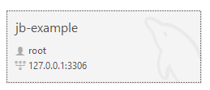
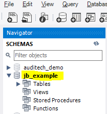
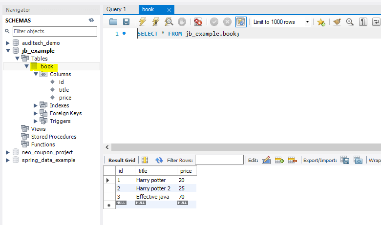

**Setup**
-
- Before using MySQL through Java, you must install MySQL on your computer.
MySQL is a database application, and it does not necessarily need a user interface in order
to work, but of course we will want to manage it nicely through MySQL Workbench, which
is MySQL's GUI (Graphical User Interface)
https://dev.mysql.com/downloads/installer/

- Afterwards, we would want to several things:
1. database connection (set a password that you will remember)

2. schema

3. table

** **
**Controlling MySQL through Java**
-
- After downloading MySQL, we will need a code infrastructure that knows
how to connect to it. For this purpose we have jdbc, a set of java libraries
that provide an API that connects to SQL databases (MySQL, MSSQL, PostgreSQL, etc...) with
MySQL workbench we will use the appropriate jdbc library - mysql-connector/J

https://dev.mysql.com/downloads/connector/j/?os=26
- Make sure that your MySQL Server and jdbc versions
match, in this course we will use version 8.0.27

- After downloading the mysql-connector/J jar, you will need to place
it somewhere comfortable (usually a lib folder under your project) and
then you will have to include the jar in the project's classpath:
- Open module settings -> Project settings -> Libraries -> Add(+ icon) -> choose the jar you just downloaded
- Once the jar is added to the project, you will have the jar's packages
and classes available in your code